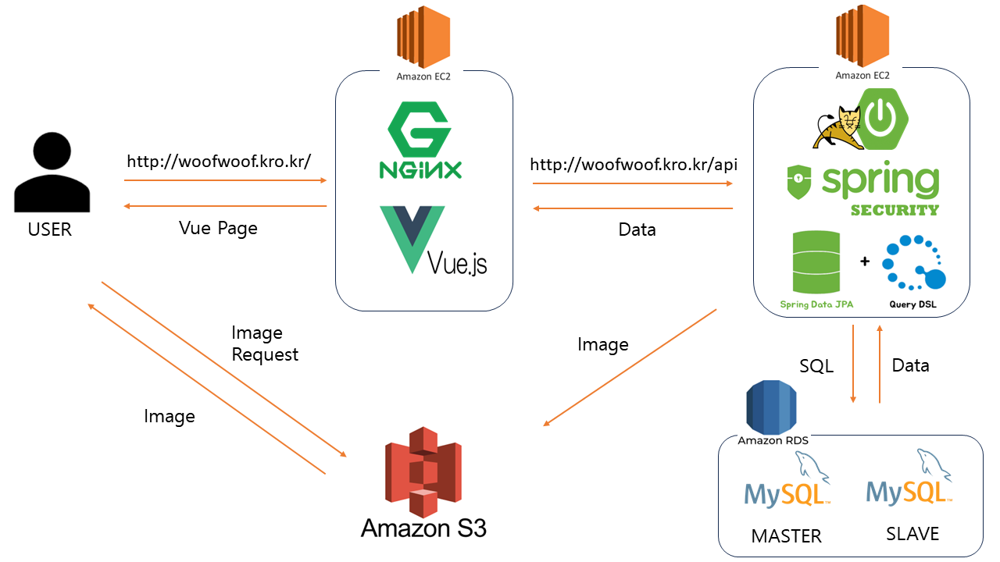

<h1 align="center">
반려동물 케어 서비스

🐾 **우리 아이 프렌드, WOOF!** 🐾</h1>

> [플레이 데이터] 한화시스템 BEYOND SW캠프 / Woof

> [WOOF]http://woofwoof.kro.kr/

 

##  🌅 프로젝트 배경

유로모니터 인터네셔널에 따르면 지난해 세계 반려동물 시장 규모는 1680억 달러로 올해는 9.5% 성장한 1840억 달러 규모가 전망된다.

(...)

펫(pet)과 인간화(Humanization)가 합쳐진 ‘펫휴머니제이션’, 즉 동물을 사람처럼 생각하는 소비자들의 트렌드를 꼽았다. 반려동물 소비자들이 반려동물을 자기와 동일시하거나 가족처럼 대하면서 반려동물 시장의 프리미엄화를 이끌고 있다는 것이다.  
>출처 : [농수축산신문](https://www.aflnews.co.kr/news/articleView.html?idxno=251068)

## ✨ 프로젝트 소개

 * 펫휴머니제이션 시대를 살아가는 반려인과 반려동물들을 위한 특별한 펫시터 서비스를 제공하기 위한 서비스입니다.

 * 사용자들이 전문적인 반려동물 케어 서비스(미용, 병원)를 찾고 원하는 펫시터(매니저)를 선택하여 반려동물에게 필요한 케어를 쉽게 찾을 수 있도록 도와줍니다.

 * 이 서비스를 통해 효과적이고 편리하게 반려인과 반려동물이 더 나은 삶을 즐길 수 있기를 바랍니다.

## 📌 프로젝트 목표

  HTML, CSS, JavaScript, Vue.js 등을 이용해서 기존 백엔드 프로젝트(be02-2nd-woof-animal_careservice)와 연계하여
  이용자의 회원가입 및 로그인, 정보수정, 조회가 가능하도록 구현하였습니다.

  로그인 후 Ceo와 Manager는 상품을 CRUD를 할 수 있습니다.

  Member는 상품을 List와 Read기능을 통해 조회 후 Orders 기능을 통해 상품을 주문 할 수 있습니다.
  
  사용자는 Review를 조회할 수 있고, 주문을 한 사용자(Member)는 Review 작성, 수정이 가능합니다.
 

## 프로젝트 설계

 

## 💻STACKS

	
	
	
  

</a>
</a></a>
 
</a></a>
</a></a>
</a></a>
</a></a>
</a></a>
</a></a>

## 🔍 요구사항 명세서

자세히 보기(클릭)

[1] 사용자
1. Woof에 회원가입을 할 수 있습니다.
   -> e-mail, PW, 닉네임, 전화번호, 반려동물정보를 입력해야 합니다.
2. 이메일 인증이 완료된 후 로그인 할 수 있습니다.
3. 헤더의 메뉴를 통해 업체조회, 매니저조회, 예약페이지, 상세페이지(About Us), 마이페이지로 이동할 수 있습니다.
4. 업체, 매니저를 선택하여 원하는 시간대에 예약(주문)할 수 있습니다.
   
[2] 업체 CEO (유치원, 병원, 미용실)
1. Woof에 회원가입을 할 수 있습니다.
   -> 사업자등록번호, PW, 이름, 전화번호, 업체소개를 입력해야 합니다.
2. 업체 등록을 할 수 있습니다
   -> 메뉴바에 업체를 클릭하면 업체List로 이동됩니다.
   -> CEO 권한이 부여되어있으면 상품등록 버튼이 활성화됩니다.
   -> 가게이름, 상품이름, 전화번호, 가격, 상품설명, 사진등록 모든 사항을 입력해야 합니다.

[3] Woof 매니저
1. Woof에 회원가입을 할 수 있습니다.
   -> e-mail, PW, 닉네임은 필수로 기입하고, 전화번호, 반려동물정보는 선택적으로 기입합니다.
2. 매니저 등록을 할 수 있습니다
   -> 메뉴바에 매니저를 클릭하면 매니저List로 이동됩니다.
   -> 매니저 권한이 부여되어있으면 상품등록 버튼이 활성화 됩니다.
   -> 매니저이름, 성별, 전화번호, 가격, 경력, 사진등록 모든 사항을 입력해야 합니다.

[4] 예약(주문)
1. 고객은 이름, 전화번호, 예약시간, 특이사항(요구사항), 픽업장소(매니저가 반려동물을 픽업할 장소)를 작성합니다.
2. 주문이 완료되면 예약 성공 페이지로 이동합니다.
   -> 성공페이지에서는 예약확인, 예약삭제, 예약수정 버튼을 통해 원하는 서비스가 이용 가능합니다.

[5] 리뷰
1. 사용자는 이용한 업체에 대한 리뷰 작성을 할 수 있습니다.
   ->주문한 상품 목록에 위치한 리뷰 작성하기를 통해 작성 가능합니다.
2. 해당 상품을 주문한 사용자는 리뷰 열람에 대한 권한 설정을 할 수 있습니다.
   ->리뷰를 작성하면 해당 상품의 idx 및 정보들을 불러와 해당 상품의 리뷰인 것을 확인 후 권한 부여
3. 업체는 고객의 리뷰 번호와 리뷰 내용을 확인할 수 있습니다.
   ->사용자에게 리뷰를 받으면 해당 상품과 리뷰 내용을 업체는 열람할 수 있습니다.

[6] 마이페이지
1. 사용자는 마이페이지에서 자신의 정보(닉네임, 이메일)를 확인할 수    있습니다.
2. 사용자는 회원 정보(닉네임, 비밀번호)를 수정할 수 있습니다.
3. 사용자는 마이페이지를 통해 자신의 예약내역을 확인할 수 있는 페이지로 이동할 수 있습니다.

## 기능 명세서
[Figma](https://www.figma.com/file/yjIBFhdhZncLcf8b86gVjo/woof?type=design&node-id=0%3A1&mode=design&t=yL5aeT6QrqejlCSP-1)

## 테스트 및 결과

회원 기능

 

일반 회원 가입 & 로그인
 

  

 

매니저 회원 가입 & 로그인 

 

 

업체 회원 가입 & 로그인

 

상품 기능

 

업체 등록

  

 

업체 리스트

  

 

업체 조회

  

 

업체 수정

  

 

업체 삭제

  

 

매니저 등록

  

매니저 리스트

  

매니저 조회

  

매니저 수정

  

매니저 삭제

  

주문 기능

주문 등록

  
	 
	사용자가 업체와 매니저를 선택하고 폼 데이터를 양식에 맞게 입력하면 주문 전송이 완료된다

 

주문 내역 확인 

  
    주문 데이터를 보내면 예약내역, 삭제하기, 수정하기 창으로 넘어가게 되고 
  내역을 누르면 사용자의 주문 내역이 모두 불러와진다

 

주문 수정

  
 사용자가 주문 수정하기를 누르면 수정 가능한 양식이 나오고 양식에 따라 작성 후 주문 데이터를 전송하면 주문 수정이 이뤄진다

 

주문 삭제

  
	 주문 삭제를 누르면 주문 삭제 후 메인 페이지로 이동하게 된다 

 

마이페이지 기능

 

회원 정보 수정

  

 

예약 내역

  
  

 

리뷰 기능

 

리뷰 등록

  

 

결제 기능

결제 기능

자세한 사진은 Docs/실행결과 폴더 확인해주세요.

## 🤼‍♂️팀원

**👽️팀원 : 강문혜**

**✨️팀원 : 강지흔**

**💚️팀원 : 김주연**

**🙂️팀원 : 김지은**

**🚀️팀원 : 이창훈**
